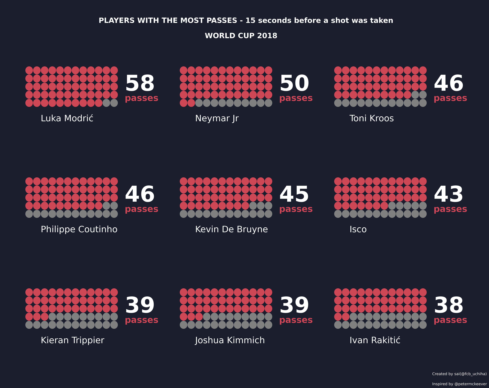

# Football Data Visualization Portfolio
Welcome to my Football Data Visualization Portfolio. This repository showcases my work as an aspiring football data scientist, highlighting various Jupyter notebooks dedicated to visualizing and analyzing football-related data.

  

## Overview

In this portfolio, you will find a collection of Jupyter notebooks that cover a wide range of football-related topics. These notebooks are designed to help you explore and understand different aspects of football through data visualization and analysis. Whether you're a football enthusiast, a data scientist, or simply curious about the beautiful game, you'll find valuable insights and visualizations here.

## Notebooks
Here's a list of some of the notebooks you'll find in this repository, along with brief descriptions of what each of them focuses on:

- `Waffle_plot.ipynb`: The analysis explores the specifics of how tthe most prolific goal scorers in 2019 scored their goals.
- `Dotmatrix_plot.ipynb`: This visualization showcases the top football players based on the number of passes they made in the 15 seconds leading up to a shot during the World Cup 2018. It provides insights into the playmaking abilities and involvement of these players in critical moments.
- `Mini_Challenge.ipynb`: My first take on Football Data analysis featuring David Sumpter.

## Data
If a notebook uses external data sources, you will find information on how to obtain or link to those data sources within the respective notebook.

## Contributing
If you're interested in contributing to this portfolio or have suggestions for improvements, please feel free to reach out. Contributions and collaborations are always welcome.

## Acknowledgments
I would like to acknowledge the football community and the creators of open football datasets, which have made projects like these possible.

## Contact
If you have any questions, feedback, or would like to connect, you can reach me at manirajadapa@gmail.com.

## Troubleshooting
If you encounter any issues or have trouble running the notebooks, please contact me or open an issue.

